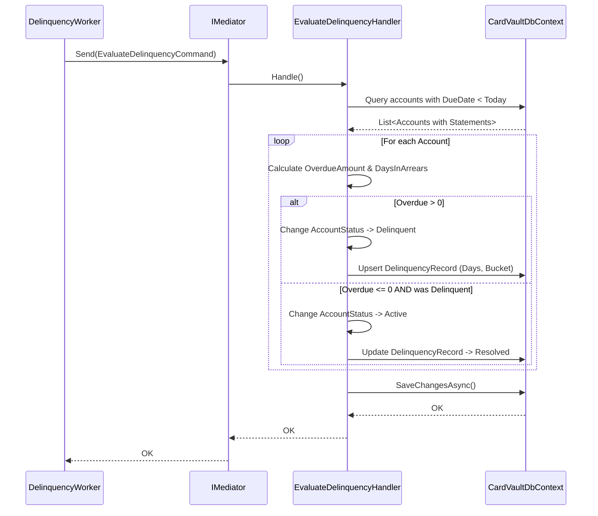

# Design: Mora Temprana

## 1. Context & Architecture
This document details the technical implementation of the `mora-temprana` (Early Delinquency) feature within the `CardVault` modular monolith. The solution requires identifying unpaid accounts after their statement due date, transitioning their status, and tracking the delinquency lifecycle.

## 2. Data Model Changes

### New Entity: `DelinquencyRecordEntity`
Table: `DelinquencyRecords`
*   `Id` (Guid, PK)
*   `AccountId` (Guid, FK to `Accounts`)
*   `StatementId` (Guid, FK to `Statements` - the statement that triggered the delinquency)
*   `OverdueAmount` (Decimal)
*   `DaysInArrears` (Int)
*   `Bucket` (String/Enum) - mapped to `1_TO_30`, `31_TO_60`, `61_TO_90`, `OVER_90`
*   `Status` (String/Enum) - `ACTIVE` or `RESOLVED`
*   `CreatedAt`, `UpdatedAt` (Timestamps)

### Updates to Existing Entities
*   `CardAccountEntity`: The `Status` property (mapped to `AccountStatus` enum) MUST support the value `Delinquent`.

## 3. Application Components

### A. `EvaluateDelinquencyCommand`
*   **Location:** `CardVault.Application/Features/Delinquency/Commands/EvaluateDelinquencyCommand.cs`
*   **Payload:** None (or maybe a `DateTime ReferenceDate` for idempotency/testing).
*   **Behavior (Handler):**
    1.  Fetch accounts where `Status` is `Active` or `Delinquent` AND they have a statement with `DueDate < ReferenceDate`.
    2.  For each account, calculate `OverdueAmount` = `MinimumPayment` - `TotalPaymentsReceived` (since statement cutoff).
    3.  If `OverdueAmount > 0`:
        *   If account is `Active`, change to `Delinquent`.
        *   Upsert `DelinquencyRecordEntity` for the account/statement. Set `DaysInArrears` = `ReferenceDate - DueDate`. Calculate `Bucket`.
    4.  If `OverdueAmount <= 0` and account is `Delinquent`:
        *   Change account status back to `Active`.
        *   Mark active `DelinquencyRecordEntity` as `Resolved`.
    5.  Save changes to the database.

### B. `DelinquencyEvaluationWorker`
*   **Location:** `CardVault.Api/Background/DelinquencyEvaluationWorker.cs`
*   **Type:** `BackgroundService`
*   **Behavior:**
    *   Runs on a daily schedule (e.g., every 24 hours at 01:00 AM).
    *   Creates a new dependency injection scope.
    *   Resolves `IMediator` and dispatches `EvaluateDelinquencyCommand` with `DateTime.UtcNow.Date`.
    *   Logs the execution result (success, accounts processed, errors).

## 4. Sequence Flow

## 5. Performance Considerations
*   **Batching:** If the number of accounts is large, the handler SHOULD process accounts in batches (e.g., 500-1000 per transaction) to avoid massive memory consumption and long-running DB transactions.
*   **Indexing:** Ensure an index exists on `Statements.DueDate` and `Accounts.Status` to speed up the daily query.
